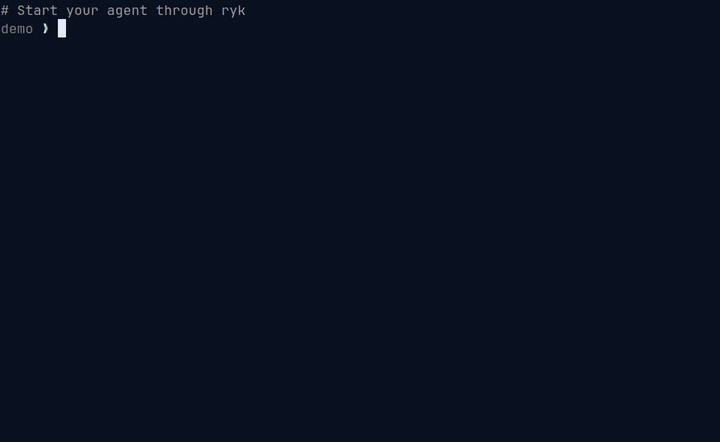

<p align="center">
  <a href="https://rykanv.com/">ویب سائٹ</a> ·
  <a href="https://discord.gg/uZn9MDUYKx">Discord</a> ·
  <a href="CONTRIBUTING.md">شراکت</a> ·
  <a href="SECURITY.md">سیکیورٹی</a>
</p>

<p align="center">
  <a href="README.md">English</a> ·
  <a href="README.zh-CN.md">简体中文</a> ·
  <a href="README.es.md">Español</a>
</p>

<p align="center">
  <a href="https://github.com/christopherkarani/ryk/actions/workflows/build.yml"></a>
  <a href="https://github.com/christopherkarani/ryk/blob/main/LICENSE"></a>
  <a href="https://github.com/christopherkarani/ryk"></a>
</p>

# ryk

**coding agents کے لیے مقامی guardrails۔**

Claude Code، Codex، Pi، OpenCode، Hermes، OpenClaw یا Grok کو ایک مقامی binary کے ذریعے چلائیں۔ ryk commands، files، secrets، network اور MCP actions کو آپ کی مشین تک پہنچنے سے پہلے چیک کرتا ہے — allow / ask / deny / observe — اور ثبوت ڈسک پر محفوظ رکھتا ہے۔

<p align="center">
  
</p>

<p align="center"><em>Agent <code>rm -rf</code> کی کوشش کرتا ہے۔ ryk اسے deny کر دیتا ہے۔ Session آپ کے laptop پر رہتی ہے۔</em></p>

## انسٹال کریں

```sh
curl -fsSL https://rykanv.com/install | sh
```

## ایجنٹ شروع کریں

```sh
ryk claude    # or: codex | pi | opencode | openclaw | hermes | grok
```

پچھلی agent sessions میں risky commands اور secret جیسے exposure کے لیے scan کریں:

```sh
ryk scan
```

اگر ryk نے آپ کو ایک بُری دن سے بچایا ہو تو [repository کو star کریں](https://github.com/christopherkarani/ryk) — اس سے دوسرے engineers کو یہ تلاش کرنے میں مدد ملتی ہے۔

## آپ کو کیا ملتا ہے

| | |
| --- | --- |
| Host integrations | Pi، Hermes، OpenCode، Codex، Claude Code، OpenClaw اور Grok کے لیے launch aliases۔ Cursor host discovery اور اس کے shell hook کے ذریعے supported ہے۔ |
| OS sandboxing | دستیاب ہونے پر macOS پر Seatbelt اور Linux پر Landlock کے ساتھ خودکار OS filesystem sandboxing۔ Windows پر OS sandbox نہیں (صرف wrapper/hook grade)۔ |
| Secret redaction | audit اور replay data لکھنے سے پہلے secret جیسے values redact ہوتے ہیں۔ |
| MCP protection | MCP tool calls مقامی طور پر classify ہوتے ہیں، اور supported stdio servers ryk کے protected proxy سے گزرتے ہیں۔ |
| 86 safety packs | تباہ کن اور حساس operations کے لیے built-in command patterns، project-level opt-in packs کے ساتھ۔ |
| Policy decisions | مقامی actions کے لیے `allow`، `ask`، `deny` اور `observe` decisions۔ |
| Local evidence | localhost dashboard (blocked commands کا Terminal view سمیت) اور sessions، decisions اور audit records کے لیے replay commands۔ |
| ایک مقامی binary | Zig CLI launch، evaluation، policy checks، host adapters اور diagnostics کا مالک ہے۔ |


### معاون ہوسٹس

| ہوسٹ | داخلی نقطہ | انضمام کا نقطہ |
| --- | --- | --- |
| Pi | `ryk pi` | Bundled extension |
| Hermes | `ryk hermes` | `pre_tool_call` |
| OpenCode | `ryk opencode` | `tool.execute.before` |
| Codex | `ryk codex` | `PreToolUse` |
| Claude Code | `ryk claude` | `PreToolUse` |
| OpenClaw | `ryk openclaw` | `tool.before` |
| Grok | `ryk grok` | `PreToolUse` |
| Cursor | Host discovery اور `cursor-agent` preset | `beforeShellExecution` |


## پالیسی کیسے کام کرتی ہے

ryk ہر guarded action کو مقامی طور پر evaluate کرتا ہے۔ اہم policy surfaces یہ ہیں:

| سطح | مثالیں |
| --- | --- |
| Commands | Shell commands، pipelines، redirects اور interpreters |
| Files | Workspace files، project control files اور sensitive paths |
| Environment | Inherited variables اور secret access |
| Network | Host allowlists اور mediated outbound connections |
| Tools | effects پر map ہونے والے MCP اور host tool calls |

policy mode response کنٹرول کرتا ہے:

| موڈ | رویہ |
| --- | --- |
| `observe` | supported actions کو block کیے بغیر decisions record کرتا ہے |
| `ask` | جب host انہیں resume کر سکے تو risky actions کے لیے prompt کرتا ہے |
| `strict` | rule کی اجازت کے بغیر unknown یا risky actions deny کرتا ہے |
| `ci` | prompts کے بغیر strict behavior چلاتا ہے؛ `ask` deny بن جاتا ہے |

Explicit deny rules کو ترجیح حاصل ہے۔ Safety packs commands اور effects classify کرتے ہیں، مگر deny rule کے اوپر permission نہیں دیتے۔

Built-in preset validate کریں:

```sh
ryk policy check --preset ask
```

policy files، priorities اور examples کے لیے [policy reference](docs/policy.md) دیکھیں۔

## سیفٹی پیکس

Safety packs shell evaluator میں focused command coverage بڑھاتے ہیں۔ `core.*` اور `system.disk` جیسے baseline packs default طور پر enabled ہیں۔

```sh
ryk packs
ryk packs show core.git
ryk packs enable containers.docker database.postgresql
ryk packs disable containers.docker
```

Git workspace میں project pack choices `.ryk.toml` میں محفوظ ہوتی ہیں۔ scripts اور diagnostics کے لیے `ryk packs` استعمال کریں۔

بغیر چلائے command test یا explain کریں:

```sh
ryk test "git status"
ryk test "rm -rf /" --format json
ryk explain "rm -rf /"
```

## ساخت

Launch aliases، host adapters، shell evaluator اور policy engine ایک ہی local decision path share کرتے ہیں۔

<p align="center">
  
</p>

1. ایک launch alias agent کو ryk کے session defaults کے ساتھ شروع کرتا ہے۔
2. Host adapters shell اور tool events evaluator کو بھیجتے ہیں۔
3. Evaluator policy rules، safety-pack matches اور active mode کو ملاتا ہے۔
4. ryk action کو allow، ask، observe یا deny کرتا ہے۔
5. Session dashboard اور replay commands کے لیے local evidence record کرتی ہے۔

## ڈیش بورڈ

localhost dashboard شروع کریں:

```sh
ryk dashboard
```

[http://127.0.0.1:7742](http://127.0.0.1:7742) کھولیں۔ server default طور پر localhost-only ہے اور موجودہ ryk policy اور CLI paths استعمال کرتا ہے۔

smoke tests اور automation کے لیے `--once` ایک request serve کر کے exit ہو جاتا ہے:

```sh
ryk dashboard --once
```

## حدود

ryk graded mediation ہے، universal OS sandbox نہیں۔ یہ macOS/Linux-first ہے۔ Windows sessions wrapper/hook grade پر چلتی ہیں، OS sandbox کے بغیر۔ absolute-path binaries، non-shimmed tools، non-proxy traffic اور وہ host hooks جو fire نہیں ہوتے، کسی خاص enforcement surface سے باہر رہ سکتے ہیں۔ `ryk doctor` platform capability report کرتا ہے؛ یہ ثابت نہیں کرتا کہ child session OS sandbox سے attach ہوئی، اور Windows کو `OS-enforced` پر promote نہیں کر سکتا۔ مضبوط دعوے کرنے سے پہلے [compatibility matrix](docs/compatibility.md) اور [threat model](docs/threat-model.md) پڑھیں۔

release builds میں opt-in product telemetry شامل ہے: `ryk telemetry enable` چلانے کے بغیر کچھ collect یا send نہیں ہوتا۔ exact payload contract کے لیے [docs/telemetry.md](docs/telemetry.md) دیکھیں۔

## دستاویزات

[documentation index](docs/README.md) سے شروع کریں۔ سب سے مفید guides یہ ہیں:

- [Install and release artifacts](docs/install.md)
- [Quickstart](docs/quickstart.md)
- [Commands](docs/commands.md)
- [Policy](docs/policy.md)
- [Credentials and secret handling](docs/credentials.md)
- [MCP](docs/mcp.md)
- [Platform notes](docs/platform-linux.md)
- [Windows platform](docs/platform-windows.md)

## شراکت

ryk Zig 0.16.0 سے build ہوتا ہے۔ checkout سے:

```sh
./scripts/zig version
./scripts/compile-fast.sh check
./scripts/zig build test-shell-engine
```

pull request کھولنے سے پہلے [CONTRIBUTING.md](CONTRIBUTING.md) پڑھیں۔ security issues کے لیے [SECURITY.md](SECURITY.md) استعمال کریں۔

## کمیونٹی

- [ویب سائٹ](https://rykanv.com/)
- [Discord](https://discord.gg/uZn9MDUYKx)
- [GitHub issues](https://github.com/christopherkarani/ryk/issues)

## لائسنس

Apache 2.0۔ [LICENSE](LICENSE) دیکھیں۔
